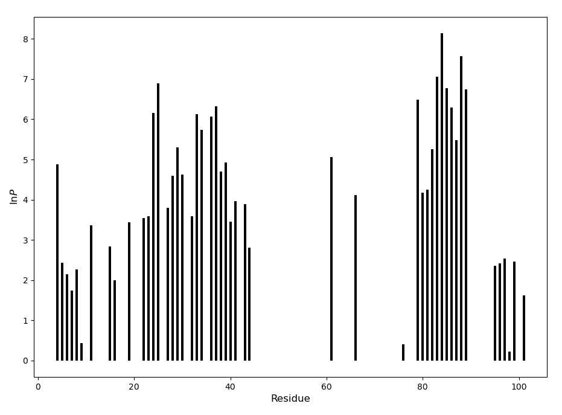
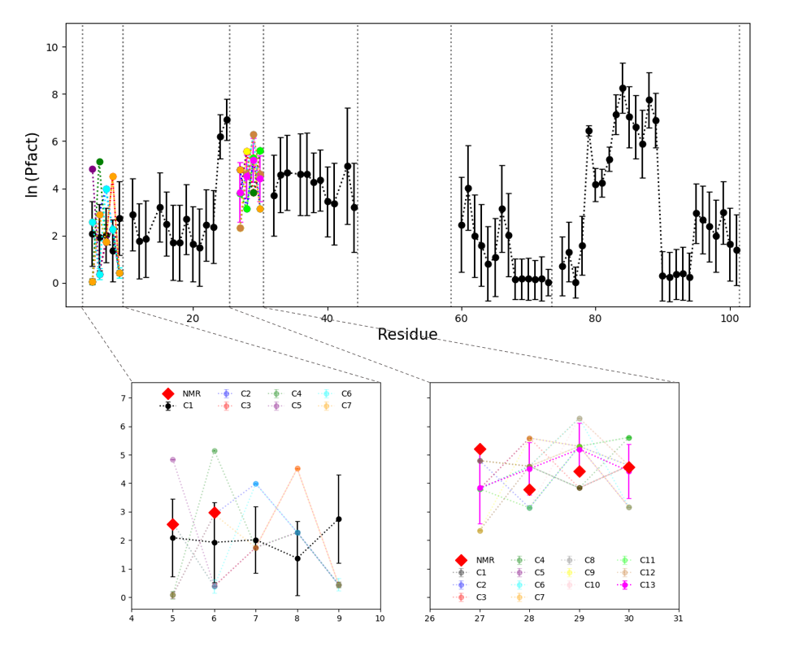

# Experimental validation

This folder contains the necessary information to reproduce the results published in *paperlink*, 
showing a correlation between protection factors extracted by ExPfact and more accurate NMR measurements. 

## Dataset

The dataset was previosly published by [Moulick et al. (2015)](https://www.ncbi.nlm.nih.gov/pmc/articles/PMC4646174/) 
and probed the mouse prion protein (PDB 1AG2, sequence in `moprp.seq`) with MS and NMR under the same conditions, 
i.e. pH 4 and temperature 25°C. 
In the HDX-MS experiment, the quench buffer was characterized by pH 2.4 and temperature 0°C.

The protein was digested by pepsin, and 14 peptides were identified with a 73% coverage (file `moprp.list` and `moprp.ass`). 
The exchange was monitored at 15 exchange times ranging from 5 seconds to 24 hours (file `moprp.times`).
The deuterium uptake curves for each peptide were normalized (0<=D<=1) using a fully deuterated sample. 
The peptide map and the uptake of peptides 4 and 8 is shown below:


A subset of 27 amino acids was covered by both MS and NMR techniques. 

## Test minimization

To run a single minimization:

``` python ../python/exPfact.py --temp 298 --pH 4.4 --dexp moprp.dexp --ass moprp.list --rand 10000 --tol 1e-12 --seq moprp.seq --out test ```

Check that the output file `test.diff` contains values with order of magnitude lower than E-02.
The predictions for the deuterium uptake curves are stored in the output file `test.Dpred`. 
If you plot the results (here we used the python library matplotlib), you should get results similar to the ones showed below. 
The plot shows the predictions fot peptides 1, 10 and 14 and the content of the `test.diff` file.


Since the minimization procedure is randomly initialized, results may differ.
It might happen that some peptides are poorly fitted with respect to others (e.g. peptide 15 in this case).
This artifact is drastically reduced when combining the results from multiple minimization.

## Cross-validation

ExPfact enables the activation of a penalty term in the cost function, which favors the finding of *smooth* solutions
based on the correlation between protection factors and the structure of the protein:

<p align="center">
  
</p>

To set up the penalty term, cross-validation must be performed to set up the penalty term.
To perform leave-one-out cross validation, digit:

``` python ../python/cross_validation.py --dexp moprp.dexp --ass moprp.ass --temp 298 --pH 4.4 --seq moprp.seq ```

⚠️ This calculation is computationally expensive. For each lambda value, the minimization procedure is repeated 
15 times, each time leaving one time point out.
With the default values for lambda (1E-15, 1E-9, 1E-8, ..., 1E-1), the number of minimization is 15x15=225. 
Also, since in this case the minimization procedure starts from the same initial guess on the protection factors
(i.e., all P are set to 1), the user will obtain the same results provided in the file `CV.res`, plotted below,
which show that a minimum occurs at `lambda=1E-08`.


In the plot above, the dashed line represents the train error, the dotted line the test error, the solid line
the sum of train and test error. 

## Multiple minimizations

To calculate 5,000 solutions, use the following command:

``` python ../python/exPfact.py --temp 298 --pH 4.4 --dexp moprp.dexp --ass moprp.list --harm 1e-8 --rand 10000 --seq moprp.seq --tol 1e-15 --out out --rep 5000 ```

⚠️ This calculation is computationally expensive. 
The script generates the outputs `out1.pfact`, `out1.diff`, `out1.Dpred`, ..., `out3000.pfact`, `out3000.diff`, `out3000.Dpred`.

To analyse the solutions with descriptive statistics, run the following command:

``` python ../python/descriptive.py --res res --top 50 ```

The script selects and analyses only the 50% of solutions with lowest cost function;
the cost function associated to each solution is contained in the file `diff.list`. 
The script returns mean and median protection factors (`average.pfact` and `median.pfact`), 
a file containing the minimum and maximum value of protection factor per amino acid (`minmax.pfact`)
and a file containing all protection factors from all the selected solutions (`all.sp`).

The file `all.sp` contains the solutions generated by the analysis of 3,000/5,000 solutions.
The file `median.pfact` contains the median values of protection factors:



## Clustering algorithm

The script for the clustering algorithm assumes that a file `all.sp` is present in the working directory.
To launch the clustering algorithm:

``` python ../python/clustering.py --ass moprp.ass ```

This generates several outputs for every region covered by overlapping peptides (see folder `testing` for further details).

**The results obtained giving the file `all.sp` provided here are stored in the folder `mclust`** (see image below).
More clusters are identified for regions 5-9 and 27-30.
At least one cluster is compatible with protection factors from NMR (see file `nmr.xlsx`) 



## Isotopic envelopes

## Comparison with NMR data
